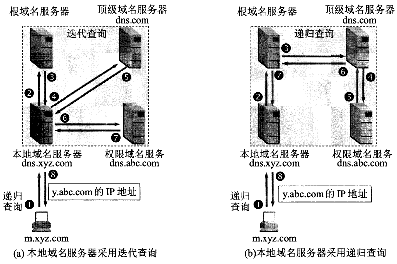

# DNS

**域名系统DNS（Domain Name System）**是互联网使用的命名系统，用来把网址解析为IP地址。

域名服务器是一个分级系统：

- 根域名服务器
- 顶级域名服务器
- 授权域名服务器
- 本地域名服务器

## 递归查询和迭代查询

## 例题

> 若本地域名服务器无缓存，则在采用递归方法解析另一网络某主机域名时，用户主机和本地域名服务器发送的域名请求消息条数分别为（）。
>
> 1. 1，1
> 2. 1，多
> 3. 多，1
> 4. 多，多

选项1正确。

> 假设所有域名服务器均采用迭代查询方式进行域名解析。当主机访问规范域名为 www.abc.xyz.com 的网站时， 本地主机在完成该域名解析过程中，可能发出 DNS 查询的最少和最多次数分别是（）

最少：本地有缓存，0次。

最多：迭代查询，因此最多可能是4次（主机->本地域名服务器，本地域名->根域名（.com），本地域名->顶级域名（xyz.com），本地域名->权限域名（abc.xyz.com））。