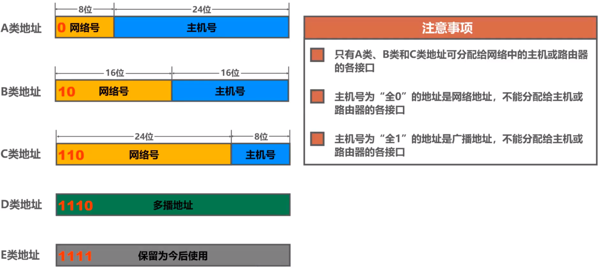
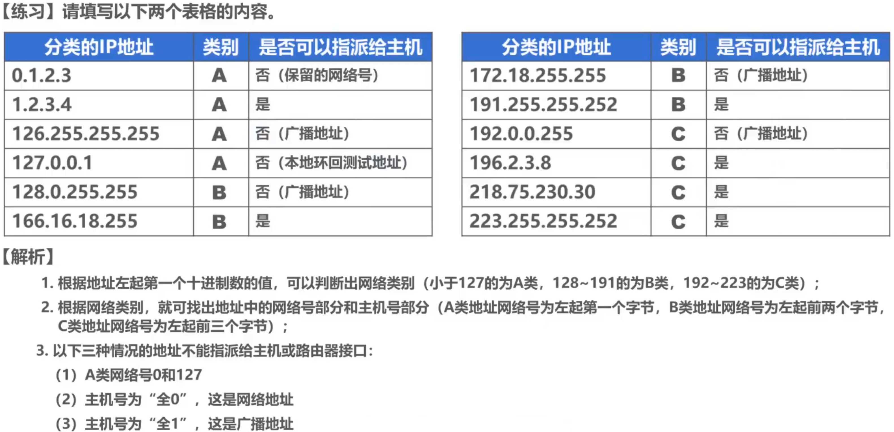
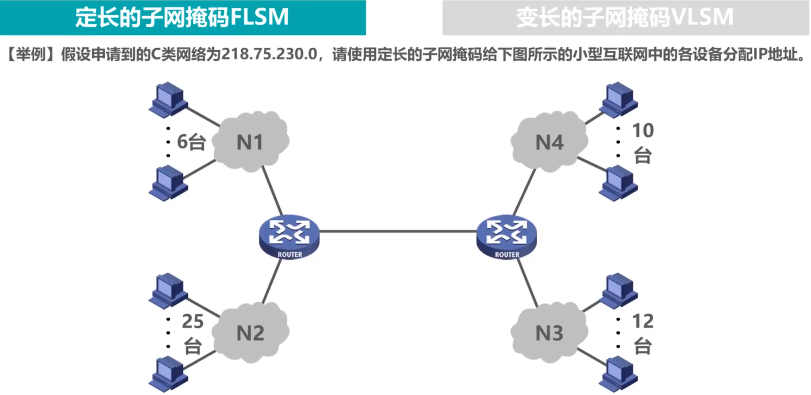
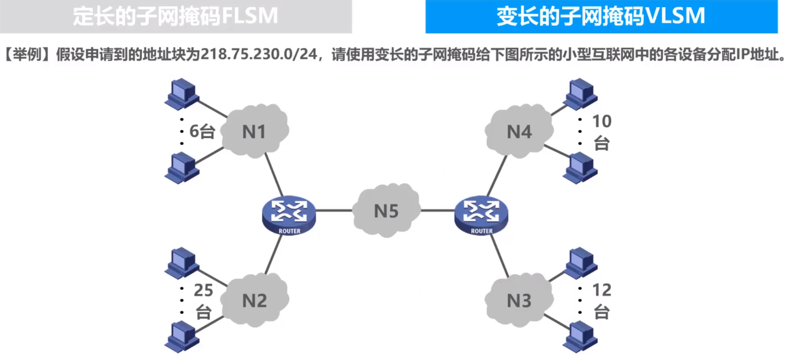
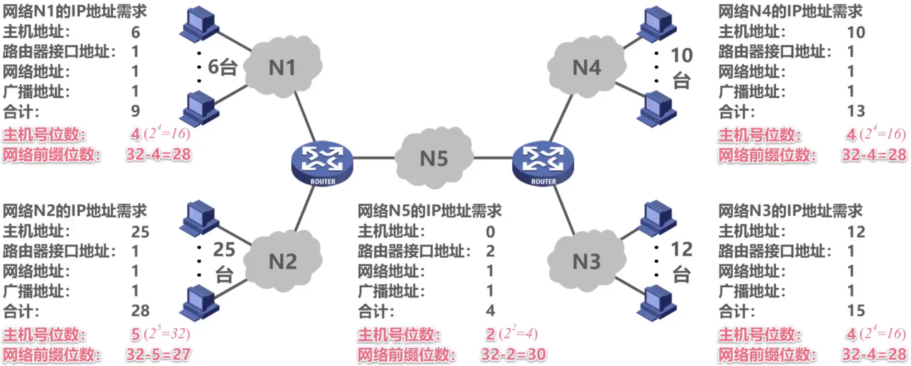

# IPv4编址

## 分类编址

IPv4的编址分类如上图所示，一共5类。

### A类地址

A类地址的网络号占8位，主机号占24位。其中网络号的第1位固定为0（这意味着A类前8位的范围是 $[0,127]$）。

- A类地址中，最小网络号0保留，不指派。
- A类地址中，最大网络号127作为本地环回测试地址，不指派。
  - 换回测试地址的取值区间是 `127.0.0.1 - 127.255.255.254`。
- 地址 `0.0.0.0` 是一个特殊的IPv4地址，只能作为源地址使用，表示“在本网络上的本主机”。

因此A类地址可指派的网络数量是 $2^{8-1}-2=126$。（去掉0和127）

每个A类网络中可分配的IP地址数量为 $2^{24}-2$。（去掉主机号为全0的网络地址和全1的广播地址）

### B类地址

B类地址的网络号占16位，主机号占16位。其中网络号高2位固定为10（这意味着B类前8位的范围是 $[128,191]$，前16位的范围是 `128.0 - 191.255`）。

B类网络可指派的网络数量是 $2^{16-2}=16384$。

B类网络可分配的IP地址数量为 $2^{16}-2=65534$。（去掉主机号为全0的网络地址和全1的广播地址）

### C类地址

C类地址中网络号占24位，主机号占8位。其中高3位的网络号固定为110（这意味着C类网络的高8位取值范围是 $[192,223]$，高24位范围是 `192.0.0 - 223.255.255`）

C类网络可指派的网络数量是 $2^{24-3}=2097152$。

C类网络可分配的IP地址数量为 $2^8-2=254$。

### 特殊地址

|   网络号   |    主机号    | 是否可以作为源地址 | 是否可以作为目的地址 |             备注/描述              |
| :--------: | :----------: | :----------------: | :------------------: | :--------------------------------: |
|   全为0    |    全为0     |        允许        |         禁止         |            表示本网主机            |
|   全为0    |   Host ID    |        允许        |         禁止         |            表示特定主机            |
|   全为1    |    全为1     |        禁止        |         允许         |   定向广播地址（在本地网络广播）   |
|    127     | 任意合法的值 |        允许        |         允许         |       环回地址，用于本地测试       |
| Network ID |    全为1     |        禁止        |         允许         | 直接广播地址（在Network ID上广播） |

### 例题

> 

## 子网掩码

子网掩码实际上就是：从主机号中借位给网络号，这样就能划分出更多的子网络。

举个例子：

上图中，一个C类网络地址 `218.75.230.x`（主机号为 `218.74.230`）通过子网掩码，向主机号借了1位，划分出了两个子网络 `218.75.230.0` 和 `218.75.230.1`。

> 子网掩码的主要作用就是：在一个确定的网络号下划分出更多的子网络，即IP地址某种程度上可以看作是 `网络号 + 子网号 + 主机号`。

## 无分类编址的IPv4

### 无类别域间路由CIDR

无类别域间路由CIDR（Classless Inter-Domain Routing）的特性如下：

- 取消了网络的分类（A类，B类，C类……）
- 在IP地址后面加一个斜杠，**后面跟着的数字 $x$ 标记IP地址的前 $x$ 位是网络号**。

斜杠后的20表示**前20位是网络号**，于是第三字段 `35` 的前4个比特就是网络号，即网络号为 `128.14.0010 = 128.14.32`。于是最小地址为 `128.14.00100000.00000000 = 128.14.32.0`，最大地址为 `128.14.00101111.11111111 = 128.14.47.255`。

地址数量取决于主机号位数：$2^{12}$。

聚合C类网的数量：这个聚合网络数量意思是**共用前20位网络号的C类网络数量**，由于C类网络的网络号有24位，因此聚合C类网的数量是 $2^{24-20}$。

### 路由聚合

其实就是找LCP（最长公共前缀）。

路由聚合的意义大概就是**用一个最长可行的网络号来表示所有子网**，类似于trie的思想？。

## IPv4的应用规划

### 定长的子网掩码

**注意到图中本质上有5个子网**（两台路由器之间还有一个隐藏的网络N5），每个网络所需要的IP地址数量如下：

这里以N1为例进行说明：

- 如图，N1子网中有6个主机和一个路由器接口，因此我们划分IP地址时需要：每个主机分配一个IP（6），路由器接口分配一个IP（1），除此以外还需要特殊地划分出**全零和全一**主机号（2）分别用作网络地址和广播地址。总计需要分配9个IP。

由于需要划分5个子网，因此需要借用3位主机号作为子网号，这样可以划分出至多8个子网，每个子网的IP地址数量为 $2^5=32$ 个，如上图所示N2需要最多的IP地址——28个，所以可以满足需求。

因此子网掩码是 `255.255.255.224`，各个子网的细节如下：

从这8个子网中任选5个分配给N1-N5网络即可。

### 变长的子网掩码

先分析每个子网需要多少网络号，并据此计算出所需的主机号位数和网络前缀位数：

以N1为例说明：

- N1子网中有6个主机和一个路由器接口，因此我们划分IP地址时需要：每个主机分配一个IP（6），路由器接口分配一个IP（1），除此以外还需要特殊地划分出**全零和全一**主机号（2）分别用作网络地址和广播地址。总计需要分配9个IP。

  因此N1子网至少需要4位主机号（$2^4\ge 9$），即16个IP地址。

具体可以这样划分（一般原则是**每个网络块IP地址的数量是2的幂次，按照网络大小从大到小分配地址**）：

- 即从IP数量需求最大的N2开始分配，N2需要28个IP，于是将 `218.75.230.0/24` 前 $32$ 个IP地址分配给N2（`218.75.230.0 - 218.75.230.31`）。此时，IPv4中的后5位被用作主机号，前24位是地址块号（~~网络号~~），中间的3位可以当作是~~子网号~~。即 `218.75.230.000xxxxx/27` 是N2的地址块号。
- 同理，有 `218.75.230.0010xxxx/28` 是N1的地址块号；`218.75.230.0011/28` 是N3的地址块号；`218.75.230.0100xxxx/28` 是N4的地址块号；`218.75.230.010100xx/30` 是N5的地址块号。

