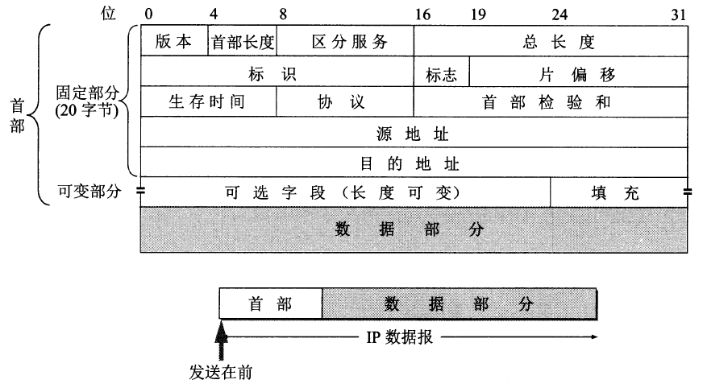

# IP数据报格式

## IP数据报首部

1. **版本**。占 $4$ 位，即IP协议的版本（目前广泛使用IPv4，版本号为 $4$）。
2. **首部长度**。占 $4$ 位，可表示的最大十进制数是 $15$。（**该字段以 $4$ 字节为单位**（$32$ 位），最小取值为 $5$，表示固定部分 $20$ 字节；最大取值为 $15$，表示固定+可变的首部最长 $20+40$ 字节）
3. **区分服务**。占 $8$ 位，只有使用区分服务时才有用。一般情况下都不使用。
4. **总长度**。占 $16$ 位，表示IP数据报的总长度（首部+数据载荷），最大取值为 $65535_{10}$（以**字节**为单位）。
5. **标识(identification)**。占 $16$ 位，IP数据报生成时会维护一个计数器（初始可能是任意数值），每生成一个数据报则计数器加一，并将该值赋给标识字段。
6. **标志(flag)**。占 $3$ 位，但只有前两位有意义。
   - **MF(More Fragment)**：$MF=1$ 表示后面还有分片，$MF=0$ 表示该数据报是最后一个分片。
   - **DF(Don't Fragment)**：$DF=1$ 表示该数据报不能分片，$DF=0$ 才允许分片。
   - 第三位无意义，固定为 $0$。
7. **片偏移**。占 $13$ 位，片偏移表示该分片在原分组中的相对位置。（**以 $8$ 字节为单位，因此每个分片的长度一定是 $8$ 字节的整数倍**）
8. **可选字段**。用来支持排错、测量以及安全等措施。很少被使用。
9. **填充字段**。确保首部长度为 $4$ 字节的整数倍，用全 $0$ 填充。

### 核心要点

- IP数据报首部固定长度20B，可变长度最多40B，因此首部长度字段占4bit（可表示范围是 $[5,15]\times 4B$）
- 标志字段弄清楚MF和DF的区别。
- 片偏移的单位是8B！因为**每个分片的长度一定是 $8$ 字节的整数倍**！
- 首部长度必须是4B的整数倍（因为首部长度字段的单位就是4B）。

