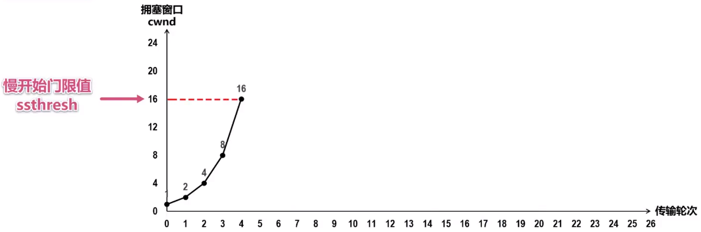
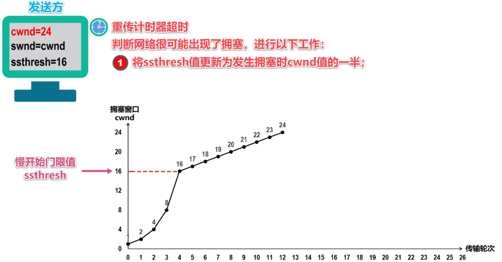
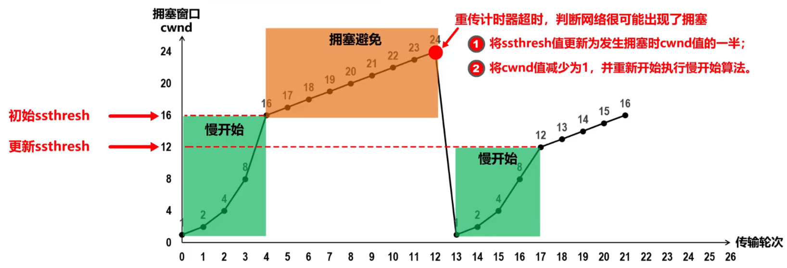
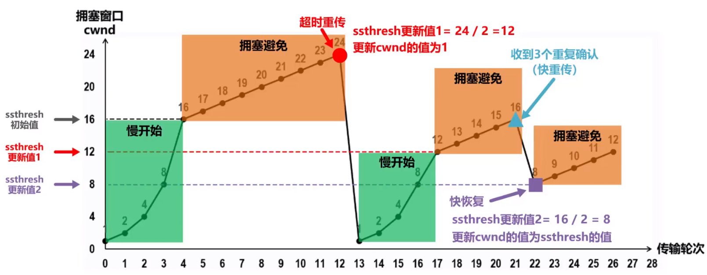

# TCP流量控制+拥塞控制

首先需要说明的一点是，TCP协议发送窗口的大小由流量控制和拥塞控制共同决定：`发送窗口的大小 = min(流量控制规定的接收窗口大小, 拥塞窗口)`。

## TCP流量控制

其实基本就是数据链路层里的滑动窗口机制。

TCP的流量控制就是：接收方可以在累计确认的报文中动态地指定当前接收窗口（rwnd）的大小，而滑动窗口机制要求发送方的发送窗口大小不超过接收窗口大小。

## TCP拥塞控制

几个名词：

1. ssthresh(The **s**low **s**tart **thresh**old)：慢开始门限值。
2. CWnd(**C**ongestion **window**)：拥塞窗口。

### 慢开始(Slow Start)

直到到达慢开始门限值(ssthresh)之前，拥塞窗口每一个传输轮次都会 $\times 2$。

### 拥塞避免(Congestion Avoidance)

当拥塞窗口大小达到慢开始门限值之后，指数增长将会转变为线性增长（每一轮增大 $1$，如下图）。

此外，当检测到网络产生了传输超时的现象时，慢开始门限值会立刻减半，拥塞窗口则会减小为1。然后再重新执行慢开始过程……

### 快重传(Fast Retransmit)/快恢复(Fast Recovery)

快重传和快恢复实际上就是：接收方在收到报文后需要发送累计确认，如果发送方连续收到 $3$ 个相同的确认，就说明出现了数据报丢失，此时就要进入快重传阶段。

快重传和快恢复实际上就是：更新慢开始门限值为当前大小的一半，然后**跳过慢开始阶段**，直接进行**拥塞避免**（线性增加）。

## 例题

> 一个TCP连接总是以1KB的最大段长发送TCP段，发送方有足够多的数据要发送。当拥塞窗口为16KB时发生了超时，如果接下来的4个RTT内的TCP段的传输都是成功的，那么当第4个RTT时间内发送的TCP段都得到肯定应答时，拥塞窗口大小是（）。

16KB时发生超时，则立刻将慢开始门限值减半变为8，拥塞窗口归1，进入慢开始。3个RTT后，拥塞窗口大小变为8，进入拥塞避免阶段，因此第4个RTT时的窗口大小应该是9。

> 主机甲和主机乙之间建立一个TCP连接，TCP最大段长度为1000字节，若主机甲的当前拥塞窗口为4000字节，在主机甲向主机乙连续发送两个最大段后，成功收到主机乙发送的第一个段的确认段，确认段中通告的接收窗口大小为2000字节，则此时主机甲还可以向主机乙发送的最大字节数是（）

本题中，发送窗口的大小 = min(流量控制规定的接收窗口大小, 拥塞窗口) = 2000B。

同时，因为主机甲成功收到主机乙发送的第一个段的确认段，因此只能再发送1000B。

> 主机甲和主机乙间已建立一个TCP连接，主机甲向主机乙发送了两个连续的TCP段，分别包含300字节和500字节的有效载荷，第一个段的序列号为200，主机乙正确接收到两个段后，发送给主机甲的确认序列号是（）。

确认序列号是下一次希望接收到的代码段，由于第一个段的序列号是200，因此800字节连续数据段中最后的一段是999，因此答案为1000。

> 主机甲与主机乙之间已建立一个TCP连接，主机甲向主机乙发送了3个连续的TCP段，分别包含300字节、400字节和500字节的有效载荷，第3个段的序号为900。若主机乙仅正确接收到第1和第3个段，则主机乙发送给主机甲的确认序号是（）。

主机乙仅正确接收到第1和第3个段，因此期望收到第2个段，确认序号为900-400=500。

> 主机甲与主机乙之间已建立一个TCP连接，双方持续有数据传输，且数据无差错与丢失。若甲收到1个来自乙的TCP段，该段的序号为1913、确认序号为2046、有效载荷为100字节，则甲立即发送给乙的TCP段的序号和确认序号分别是（）。

乙的TCP段序号为1913、确认序号为2046，因此甲的回复TCP段序号为2046，确认号为1913+100=2013。

> 主机甲和主机乙新建一个 TCP 连接，甲的拥塞控制初始阈值为 32KB，甲向乙始终以 MSS=1KB 大小的段发送数据，并一直有数据发送；乙为该连接分配 16KB 接收缓存，并对每个数据段进行确认，忽略段传输延迟。若乙收到的数据全部存入缓存，不被取走，则甲从连接建立成功时刻起，未发送超时的情况下，经过 4 个 RTT 后，甲的发送窗口是（）。

1KB->2KB->4KB->8KB->16KB（x）。

首先，接收方只有当接收缓存满了才会向上层提交数据。

1KB->2KB->4KB->8KB，此时接收缓存已经被填入了15KB，剩余1KB，接收方会告知发送方。因此发送方会更新发送窗口为1KB。

