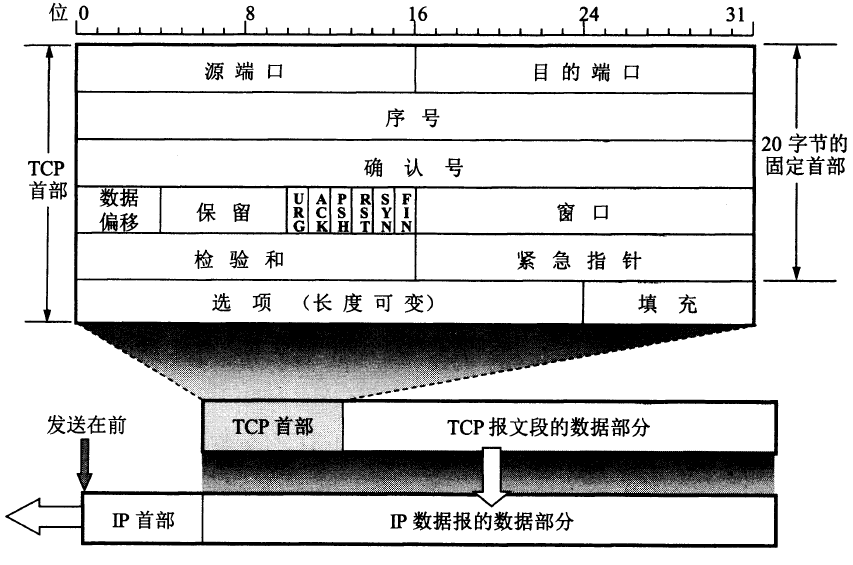

# TCP概述

## TCP最主要的特点

1. **面向连接**：TCP协议传输数据前必须建立连接，传输结束后必须释放连接。
2. **点对点**：TCP协议必须建立连接，所以只能是点对点通信。
3. **可靠交付**：TCP传输的数据必须无差错、不丢失、按序到达。
4. **面向字节流**：TCP协议将应用层报文当作字节流，因此TCP可以对应用层报文切片、合并。
5. **全双工通信**。

## 可靠传输

这部分和数据链路层中的可靠传输协议基本一致。

## TCP首部

比较重要的是6个控制位（大多数都在TCP连接中使用）

- **紧急URG(urgent)**：说明有紧急数据需要发送，提升发送优先级，而不是像原来那样排队。
- **确认ACK(acknowledge)**：建立连接后，所有报文的ACK置为1。
- **推送PSH(push)**：提升交付优先级，让对方尽快回复。
- **复位RST(reset)**：TCP连接发生严重错误，需要重新建立连接。
- **同步SYN(synchronization)**：建立连接时用来同步序号。
- **终止FIN(finish)**：用来释放连接（释放连接时FIN=1）。

此外，序号(seq)和确认号(ack)在TCP连接中有重要作用。