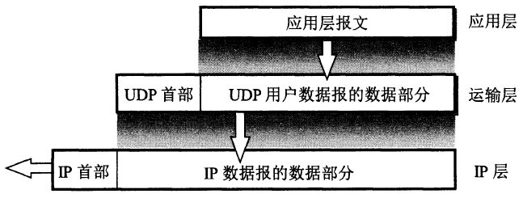

# UDP

## 特性

**用户数据报协议**（英语：**U**ser **D**atagram **P**rotocol）的特性：

- **无连接的**，发送数据不需要建立连接。

- **不保证可靠交付**，如果接收到的UDP数据报产生误码或丢失，接收方什么也不会做。

- **不处理报文**，UDP只会给应用层的报文增加一个首部，不会切片或合并报文。

  

- **没有拥塞控制**。

- **支持一对多，多对多通信**，与之相对的TCP因为需要建立连接，只支持两个节点之间通信。

## 首部

如图，UDP首部一共8字节，4个字段：

- **源端口**
- **目的端口**
- **长度**：UDP数据报的长度，最小为8（只有首部）
- **检验和**：计算检验和时，UDP数据报会加入一个伪首部，变成一个看起来20字节的首部，计算完成后就会丢弃这个伪首部。