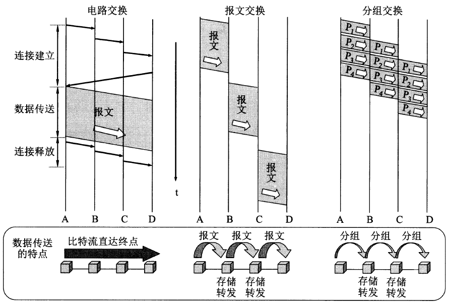

# 三种交换方式

## 电路交换

**电路交换**（英语：Circuit Switching）是相对于报文交换（或称分组交换）的一个概念。电路交换要求必须首先在通信双方之间建立连接通道。在连接建立成功之后，双方的通信活动才能开始。通信双方需要传递的信息都是通过已经建立好的连接来进行传递的，而且这个连接也将一直被维持到双方的通信结束。

> 一个直观的例子就是电话，我们在通话前需要“双方建立连接”。

## 报文交换

**报文交换**（英语：Message switching），又称存储转发交换，是数据交换的三种方式之一。相较于电路交换，报文交换不需要通信双方建立连接通道，双方通过相互发送报文进行通信。

> 一个感性的例子就是QQ聊天，两个人相互发送信息进行交流，但是我们可以不定时间回复，不需要建立持续的通信连接。

## 分组交换

简单地说，**分组交换**（英语：Packet switching）就是将一个比较大的报文切分成更小的数据报，然后将这些较小的数据报依次发送。

> **报文交换**实际上和分组交换基本上就是一个概念。

## 三种交换的对比图

## 报文交换和分组交换的速度比较

从一个例题入手：

> 主机甲通过1个路由器（存储转发方式）与主机乙互联，两段链路的数据传输速率均为10Mbps，主机甲分别采用报文交换和分组大小为10kb的分组交换向主机乙发送1个大小为8Mb（1M=1e6）的报文。若忽略链路传播延迟、分组头开销和分组拆装时间，则两种交换方式完成该报文传输所需的总时间分别为（）和（）。

首先，本题说明了忽略链路传播延迟、分组头开销和分组拆装时间，因此总时延只需要考虑发送时延。

- 报文交换

  现在计算报文交换的传输时延，由于主机甲**通过1个路由器**（存储转发方式）与主机乙互联，因此“发送”这个操作会进行2次（主机甲发送+路由器发送），因此总时延为：2x发送时延=2x8Mb/10Mbps=1.6s。

- 分组交换

  现在计算分组交换的传输时延，与报文交换不同的是，分组交换在经历“路由器转发”的过程时，主机同时也在发送数据，因此分组交换会更快一些。

  具体地，当主机甲正在发送第 $i$ 个数据报时，路由器已经接收并正在转发第 $i-1$ 个数据报。因此总时延就是：(分组数量+1)x分组发送时延=(8Mb+10kb)/10Mbps=0.801s。

因此，我们对于报文交换和分组交换的速度对比的结论就是：在需要多级转发的网络中，分组交换明显快于分组交换（因为发送和转发同时进行），并且跳数越多，分组交换越快。

*实际应用中，发送时延远大于传输时延，因此上面这个例题的假设一定程度上是合理的。

## 分组交换的实现方式

这是一个比较容易混淆的知识点，因为分组交换的实现不一定不建立连接（虚电路方式就是一种面向连接的分组交换方式）。

### 数据报方式

数据报方式就是常规理解下的分组交换，通信双方不需要建立连接，只需要相互发送数据报进行通信即可。

### 虚电路方式

虚电路就是通信双方在网络中建立一条虚拟的逻辑电路，双方建立连接后进行通信。