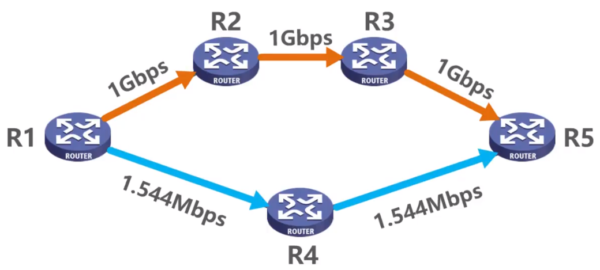
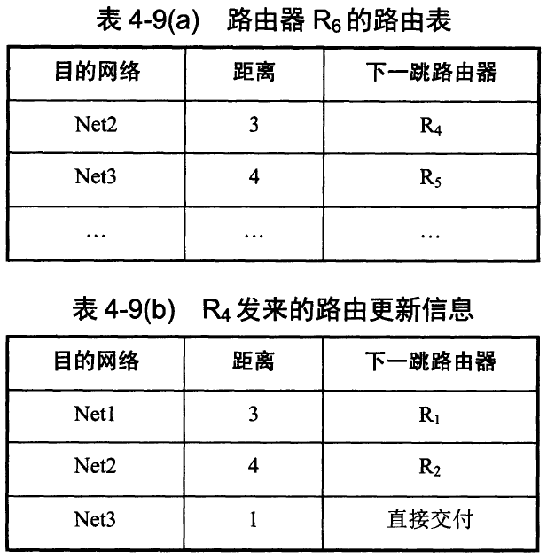
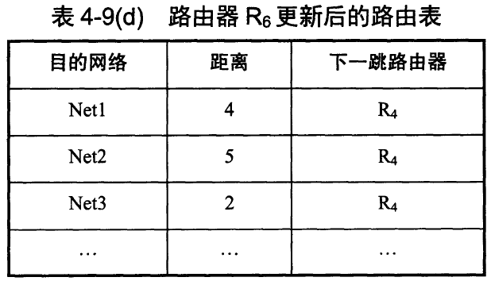

# 内部网关协议IGP(Interior Gateway Protocol)

IGP就是一个自治系统（可以理解为一系列路由器和子网络构成的系统）内路由器交换并更新路由信息的协议。

## 路由信息协议RIP(Routing Information Protocol)

### 原理

RIP要求网络中的每一个路由器都要维护从它自己到其他每一个网络的距离记录，称为**距离向量D-V(Distance Vector)**。这里，两个网络之间**距离**是跳数（Hop Count）：

- 路由器到直连网络的距离定义为1。
- 路由器到非直连网络的距离定义为**所经过的路由器数量+1**。
- 允许一条路径最多只能包含**15**个路由器。也就是说**距离=16时相当于不可达**。
- 上述特性说明RIP只适用于小型互联网。

RIP认为**好的路由**是**跳数少的路由**，如下图

好路由是R1->R4->R5（尽管这条路径实际上可能劣于其他路径）。

当有多条跳数相同的路径时，可以进行**等价负载均衡**。

**RIP的三个要点**

1. 仅和相邻路由器交换信息
2. 用自己的路由表交换信息
3. 周期性交换（一般30s交换一次）

> 也就是说，采用RIP的网络中，各个路由器之间每隔一定的时间（比如30s）都会根据与他直接相邻的路由器进行距离向量表的交换，用来更新最优路径。

### 距离向量算法

非常简单，直接看例题

> 已知路由器 $R_6$ 有表a所示的路由表。现在收到相邻路由器 $R_4$ 发来的路由更新信息，如表b所示。更新 $R_6$ 的路由表。
>
> 

我们用 $R_4$ 发送的路由表表项逐个更新 $R_6$：

- `Net1 3 R1`：注意到 $R_6$ 中并不存在到Net1的路径，因此直接增加表项 `Net1 4 R4`。
- `Net2 4 R2`：注意到 $R_6$ 中已经存在表项 `Net2 3 R4`，也就是说原本 $R_6$ 经由 $R_4$ 到达Net2需要3跳，而现在 $R_4$ 到Net2需要4跳，于是现在更新表项为 `Net2 5 R4`。
- `Net3 1 /`：注意到 $R_6$ 中已经存在表项 `Net3 4 R5`，也就是说原本 $R_6$ 经由 $R_4$ 到达Net3需要4跳，而现在 $R_4$ 与Net3直连，于是现在更新表项为 `Net3 2 R4`。

于是答案如下：

### “坏消息传得慢”问题

如上图，路由器R1到N1的距离原本是1跳（故障发生前），R2到N1的距离原本是2跳。

此时N1到R1的线路故障，那么R1就会更新：到N1的距离为16（不可达）。但是，在周期性交换过程中，R2的表项有可能会先将R1到N1的表项更新为 `N1 3 R2`，也就是说R1认为可以通过R2到达N1，总计需要3跳；而R2会被R1的表项更新为N1不可达。

然后就会出现一个神奇的现象：在下一次的周期性交换中，R1的表项有可能被更新为N1不可达，而N2的表项则被更新为 `N1 4 R1`；……直到两个路由器中的表项跳数均达到16为止。

## 开放最短路径优先协议OSPF(Open Shortest Path First)

一个简单的解释：

- 网络中的每个路由器都会发送广播信息，通过BFS对整个网络建图。
- 路由器获得链路的拓扑信息后，再通过最短路径算法（dijkstra等）计算出单源最短路径。
- 只有当链路信息发生变化时，路由器才会广播发送信息，重新建图。

