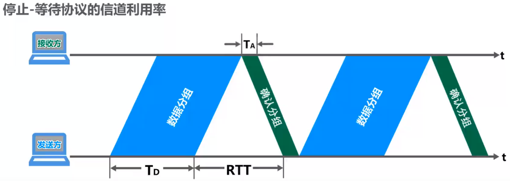
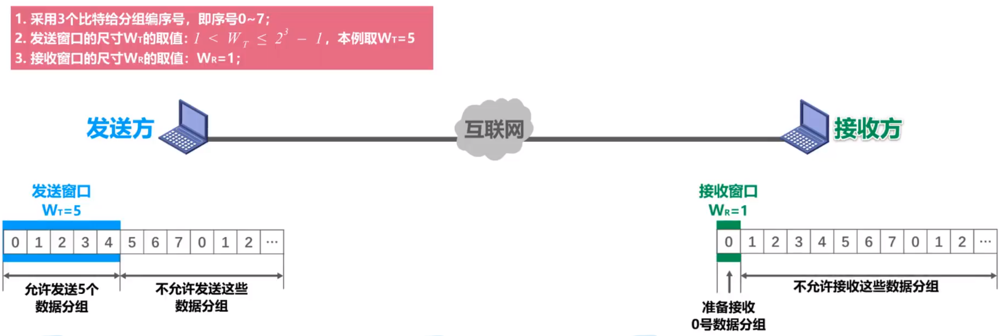
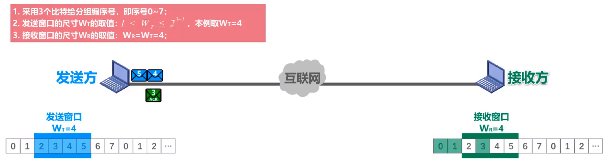
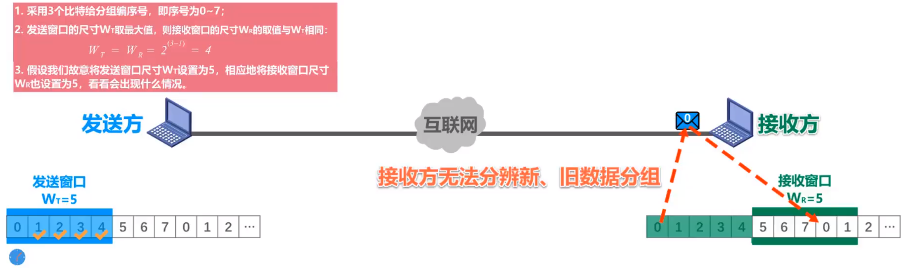

# 可靠传输

由于数据链路层需要负责传输很多的分组（在数据链路层的角度，就是一系列封装好的帧），而实际网络情况复杂，如何确保两个通信节点之间的可靠传输就是一个重要的问题。

## 停止-等待协议SW(Stop-and-Wait)

### 简介

- SW其实就是**发送方每发送一个帧，就必须等待直至收到接收方的确认帧（ACK）**，然后再发送下一帧数据。
- 如果传输过程中产生了误码，接收方发送误码帧（NAK），发送方重新发送这一帧的数据。
- 为了应对帧在发送过程中丢失的问题，建立了超时重传机制。重传时间一般**略大于发送方到接收方的平均往返时间（RTT）**。
- 为了让接收方能够判断收到的帧是否重复了，发送方需要**给数据分组编号**。（编号只需要 $0,1$ 就够了）
- 为了应对确认迟到问题（这会造成接收方收到重复的帧），需要**给ACK分组编号**。（编号只需要 $0,1$ 就够了）

### 信道利用率

感性上就不难发现，SW的信道利用率是较低的，具体的计算过程可以参考上图（$T_D$ 表示发送帧的时延，$RTT$ 表示往返时延，$T_A$ 表示发送确认帧的时延），于是信道利用率就是
$$
信道利用率=U=\frac{T_D}{T_D+RTT+T_A}
$$
*其中 $T_A$ 一般都远小于 $T_D$，没有特殊说明的情况下可以忽略不计。

## 回退N帧协议GBN(Go-Back-N)

- GBN做出的核心优化就是**设置了一个发送窗口 $W_T$**，也就是发送方每次都会发送当前发送窗口内的所有帧。

- 所有的分组会进行编号，一般采用 $0,1,\cdots, 2^{n}-1$ 进行编号（上图中 $n=3$）；而发送窗口的大小需要满足 $1\le W_T\le 2^n-1$（$W_T=1$ 其实就是停止等待协议了）。

  >$1\le W_T\le 2^n-1$ 的原因是：如果 $W_T$ 超过了 $2^n-1$，那么收到的ACK就无法判断是新的分组还是旧的分组。

- 接收方需要设置一个接收窗口，接收窗口的大小 $W_R=1$ 。

- 发送方会将发送窗口中的数据分组连续地发送出去（流水线式传输），接收方如果正确接收到了数据分组，**不一定**需要对收到的数据分组**逐个发送确认**，而是可以在接收到几个数据分组后，只对**按序到达的最后一个数据分组发送确认**。

  也就是说 $ACK_N$ 表示 $N$ 以及之前的所有数据分组都已正确接收（累计确认）。

- 发送方发送窗口内某个已发送的数据分组产生超时重发时，**其后续在发送窗口内且已发送的数据分组也必须全部重传**，因此该协议称为回退N帧协议。

## 选择重传协议SR(Selective Request)

- SR和GBR的区别就是接收方的**接收窗口大小可以不取 $1$**，类似于维护一个滑动窗口。

- 发送窗口大小 $W_T$ 的取值范围是 $1\lt W_T\le 2^{n-1}$（**注意这里不同于GB**），接收窗口大小 $1\lt W_R\le W_T$。

- 如上图，假设发送窗口当前覆盖了 $\{2,3,4,5\}$ ，然后接收到了序号2的ACK，那么滑动窗口就会向右移动一个单位；如果没有接收到序号2的ACK，但是接收到了序号3的ACK，那么窗口不会右移，但是序号3会被打上标记（假设后来又接收到了序号2的ACK，那么滑动窗口就会向右移动两个单位）。

- 注意，SR协议必须**对每一个数据分组都发送ACK**。

- 需要注意 $W_T\gt 2^{n-1}$ 会造成接收方无法分辨新旧数据分组的问题。如下图，假设 $n=3,W_T=W_R=5$ ，如果接收方收到了 $0,1,2,3,4$ 并发送了ACK，那么接收方的窗口就会右移5格。此时，ACK0如果丢失，那么发送方就会重传序号0，但是接收方就会误以为收到了新的数据分组0。

  

## 例题

> 假设使用停止-等待协议；信道长度为 $2000km$，数据分组长度 $1500B$，发送速率 $10Mbit/s$（忽略 $T_A$），信号传播速度是200 000km/s，计算信道利用率。

$$
U=\frac{T_D}{T_D+RTT+T_A}=\frac{1500B/10Mbps}{1500B/10Mbps+2\times2000km/200000km/s}\approx 5.66\%
$$

> 主机甲采用停止等待协议向主机乙发送数据，数据传输速率是3kbps，单向传播时延是200ms，忽略确认帧的传输时延。当信道利用率等于40%时，数据帧的长度为（）

设帧长为 $x$，则
$$
\begin{aligned}
U=40\%&=\frac{T_D}{T_D+RTT+T_A}\\
&=\frac{x/3kbps}{x/3kbps+2\times200ms}
\end{aligned}
$$
不难解出 $x=800bit$。

> 数据链路层使用GBN协议，发送方已经发送了编号为0~7的帧，当计时器超时时，若发送方只收到0，2，3号帧的确认，则发送方需要重发的帧数是（）

收到最迟的确认是3号帧的确认，因此需要重发 $7-3=4$ 帧。

> 数据链路层采用SR协议传输数据，发送方已发送了0~3号数据帧，现已收到1号帧的确认，但0，2号帧依次超时，则此时需要重传的帧数是（）。

这题面很坑。因为0，2号帧超时，而SR不支持累计确认（每个帧都需要ACK），所以0，2都需要重传。但是3号还未说明超时，因此暂时不需要重传。

所以，答案是2。