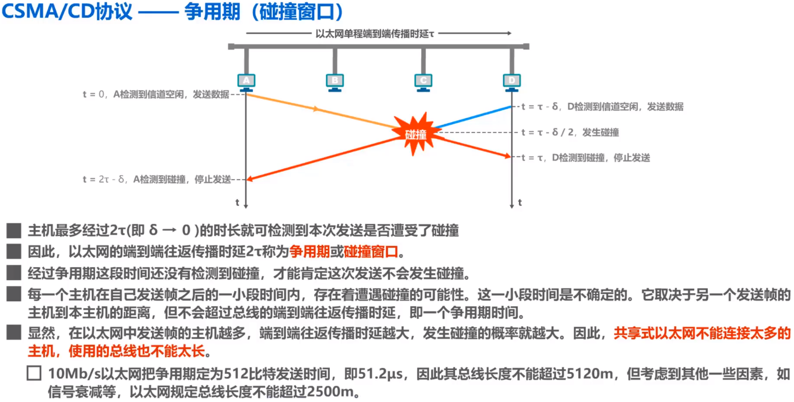
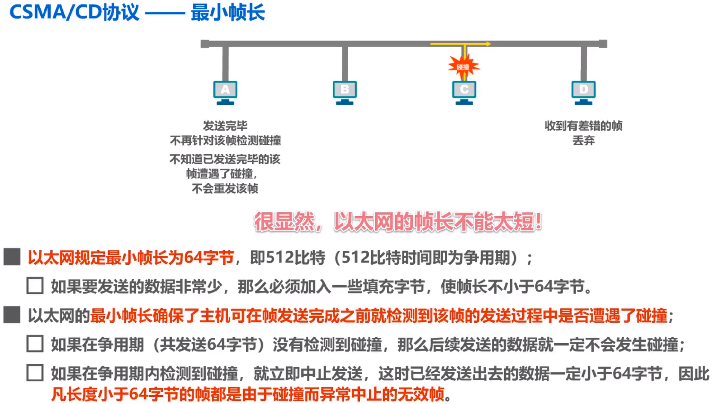
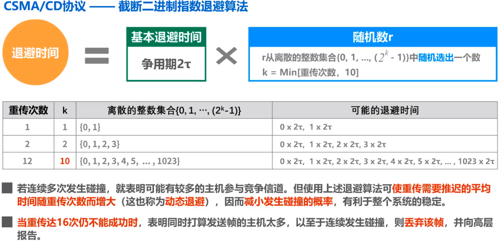
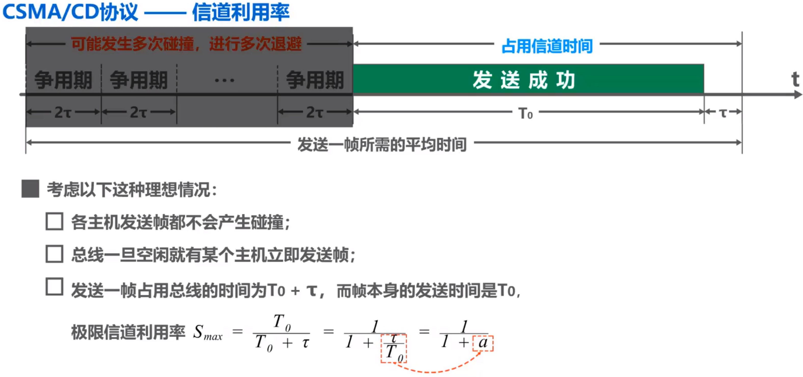

# 多路访问链路和协议

这一节内容解决的问题是：多个用户同时使用一条链路时，如何让每个用户不冲突地通信。

## 静态信道划分

前三种信道划分方案都很容易理解，比如时分复用TDM就是每个用户都划分一个时间片，轮流使用信道；所以重点是码分复用CDM的理解。

### 频分复用FDM(Frequency-Division multiplexing)

### 时分复用TDM(Time-Division multiplexing)

### 波分复用WDM(Wave-Division multiplexing)

### 码分复用CDM(Code-Division multiplexing)

码分多址CDMA(Code-Division Multiple Access)是码分复用的一种方式。它的实现思路是：建立网络时，每个站点分配一个唯一的m位码片（or芯片）序列（直白地说就是一个m位的二进制序列），当这个站点需要发送**比特1**时，就**发送这个码片序列**；当这个站点需要发送**比特0**时，就**发送这个码片序列的反码**。

> 务必明确CDMA是码分多址，小心和CSMA（载波监听多址接入）混淆。

#### 码片性质

这些码片序列必须**相互正交**，即**任意两个码片序列的规格化内积为0**。

**规格化内积**的定义如下：
$$
S\cdot T = \frac{1}{m}\sum_{i=0}^{m-1}S_iT_i
$$
其中 $S,T$ 分别代表两个码片序列。需要注意的是，这里的向量看成一个 $\pm 1$ 的序列（二进制序列中的1就是1，0看成-1）进行计算。比如码片 `00011011` 就是这个向量：$\{-1,-1,-1,+1,+1,-1,+1,+1\}$ 。

> 容易发现，如果 $S\cdot T=0$ 那么 $\overline{S}\cdot T=S\cdot \overline{T}=\overline{S}\cdot \overline{T}=0$。

#### 比特传输原理

- 当任意两个站点同时发送数据时，我们只需要将码片序列（向量）线性相加，就可以做到同时传输了。

  比如，站点1（S）要传输1，站点2（T）要传输0，那么信道中就需要传输向量 $S+(-T)$ 。

- 数据分离时，我们只需要用对应站点的码片序列和接收到的向量进行规格化内积计算。如果计算结果为 $\pm 1$ ，就说明对应站点发送的是 $\pm 1$；否则计算结果必定为0，说明该站点没有发送数据。

  > 这时因为：$S\cdot (S-T) = S\cdot S - S\cdot T = S\cdot S=1$ ；$T\cdot(S-T)=T\cdot S - T\cdot T = -T\cdot T=-1$；其实就是向量点乘的叠加原理。

- 也就是说，每当一个站点接收到一个向量后，我们用当前网络内所有用户的码片与接收到的向量均进行一次规格化内积计算，这样就能知道有哪些用户发送了信息，发送的比特信息是什么。

#### 示例

比如站点1的码片序列是 `00011011`，站点2的码片序列是 `11010001`。

> 共有4个站进行CDMA通信，这4个站的码片序列分别为：
>
> 1. `-1 -1 -1 +1 +1 -1 +1 +1`
> 2. `-1 -1 +1 -1 +1 +1 +1 -1`
> 3. `-1 +1 -1 +1 +1 +1 -1 -1`
> 4. `-1 +1 -1 -1 -1 -1 +1 -1`
>
> 现在收到码片序列 `-1 +1 -3 +1 -1 -3 +1 +1`。问：哪些站发送了数据，发送的信息是？

站点1发送了1，站点2发送了-1，站点3没发，站点4发送了1。

## 随机接入协议

### ALOHA协议

#### 朴素ALOHA协议

任意传输节点在有待发送数据时，立刻发送数据。如果信道中产生了碰撞，这个节点立即（在完全传输完碰撞帧）以概率 $p$ 重传该帧，否则等待一个帧的传输时间后再次以概率 $p$ 判定是否重传，知道传输成功为止。

#### 时隙ALOHA协议

时隙ALOHA实际上就是规定了：所有传输节点必须同步，将时间划分为一系列的时隙（一个帧的传输时间），每个节点都只能在时隙开始时传输数据。

时隙ALOHA对比朴素ALOHA，效率稍高一些。

### CSMA协议

ALOHA协议的最大缺点在于所有传输节点的行动是相对独立的（相传就传），而CSMA协议簇加入了载波监听（Carrier Sense）机制来优化这一问题，也就是“任意节点在传输信息前，先检测信道是否被占用以避免无谓的碰撞”。

> 注意只是监听信道并不能完全避免碰撞，因为信息的传输是有时延的，CSMA协议簇只是极大地减小了碰撞的概率。而下文重点介绍的CSMA/CD协议就介绍了发生碰撞应该如何处理。

#### CSMA/CD

载波监听多址接入/碰撞检测(Carrier Sense Multiple Access/Collision Detection)是一种**总线型局域网**使用的协议。

##### 特性简要概括

- **载波监听CS**

  每个传输节点在发送帧之前先要检测一下总线上是否有其他站点在发送帧：

  - 若检测到总线空闲（即无信号能量从信道进入适配器），则发送这个帧。
  - 若检测到总线忙，则继续检测并等待总线转为空闲，然后发送这个帧。

- **多址接入MA**

  多个站点连接在一条总线上，竞争使用总线。

- **碰撞检测CD**

  每一个正在发送帧的站**边发送边检测碰撞**。一旦检测到碰撞，立即停止发送，等待一段**随机时间**（详见“二进制指数退避”）后再次发送。

##### 重点归纳

- **争用期**

  

  **争用期**指的是以太网的端到端传播时延，设 $\tau$ 是单程传播时延，则**争用期**就是 $2\tau$。如上图，争用期的实际意义就是：**主机最多经过 $2\tau$ 的时长就可以检测到发送的帧是否碰撞**，原理可以参考上面的图（极限情况就是主机 $A$ 发送一个帧，花费时间 $\tau$ 恰好到达终点时与主机 $D$ 刚开始发送的帧产生了碰撞，与主机 $D$ 碰撞的信息也需要 $\tau$ 的时间才能传回主机 $A$）。

  

- **最小帧长**

  

  如果帧的长度太短，就会造成“帧已经完成了传输，但是仍然发生了碰撞，并且发送方检测不到碰撞”的情况。这会导致一个问题：帧的发送方无法在“发送帧”的过程中检测到当前帧发生了碰撞，也就意味着碰撞检测这一特性无效；为此，以太网需要规定**最小帧长**，以确保不会出现这个问题。

  计算公式为
  $$
  最小帧长=2\times \tau\times 数据传播速率
  $$
  以 $10Mb/s$ 的以太网为例（争用期 $2\tau = 51.2\mu s$）
  $$
  最小帧长=51.2\mu s\times 10Mb/s=512b=64B
  $$
  也就是说 $10Mb/s$ 的以太网最小帧长为 $64Byte$。

  

- **截断二进制退避算法**

  

  **截断二进制退避算法**是处理发生碰撞的一种算法，核心思路就是：每当发送帧产生碰撞时，等待 $2k\tau$（$k$ 是整数，即 $k$ 个争用期）个单位时间后再次发送帧，整数 $k$ 的取值采用倍增的思路取随机值（第一次碰撞后，$k$ 的取值是 $0,1$ 中的随机值；第二次碰撞后，$k$ 的取值是 $0,1,2,3$ 中的随机值，……）。

  如果重传次数达到16次仍然产生了碰撞，这说明同时发送帧的主机太多，网络繁忙，此时丢弃当前帧并向高层报告。

  

- **信道极限利用率**

  

  这是个很简单的定义，说的是CSMA/CD协议在**不碰撞**的情况下，信道的运行效率（发送一帧的时延/(单程传播时延+发送一帧的时延)）。

### 例题

>下列关于CSMA/CD协议的叙述中，错误的是（）
>
>1. 边发送数据帧，边检测是否发生冲突
>2. 适用于无线网络，以实现无线链路共享
>3. 需要根据网络跨距和数据传输速率限定最小帧长
>4. 当信号传播时延趋近于0时，信道利用率趋近100%

显然选项2错误，无线网络应该是CSMA/CA.

> 在一个采用CSMA/CD协议的网络中，传输介质是一根完整的电缆，传输速率为1Gbps，电缆中的信号传播速度是200 000km/s。若最小数据帧长度减少800bit，则最远的两个站点之间的距离至少需要（）
>
> 1. 增加160m
> 2. 增加80m
> 3. 减少160m
> 4. 减少80m

最小帧长的计算方法是
$$
最小帧长=2\tau\times 数据传输速率
$$
因此如果最小数据帧长度减少800bit，争用期应该减小 $2\Delta\tau$，这里的 $\Delta \tau$ 表示单程传播时间的变化量，且满足
$$
\Delta\tau = \frac{400bit}{1Gbps}=4\times 10^{-7}s
$$
所以（$\Delta s$ 表示两个传输节点的距离减小量）
$$
\Delta \tau = \Delta s /信号传播速度 = 4\times 10^{-6}s\Rightarrow\Delta s = 4\times 10^{-7}s\times 200 000km/s = 80m
$$
所以选4。