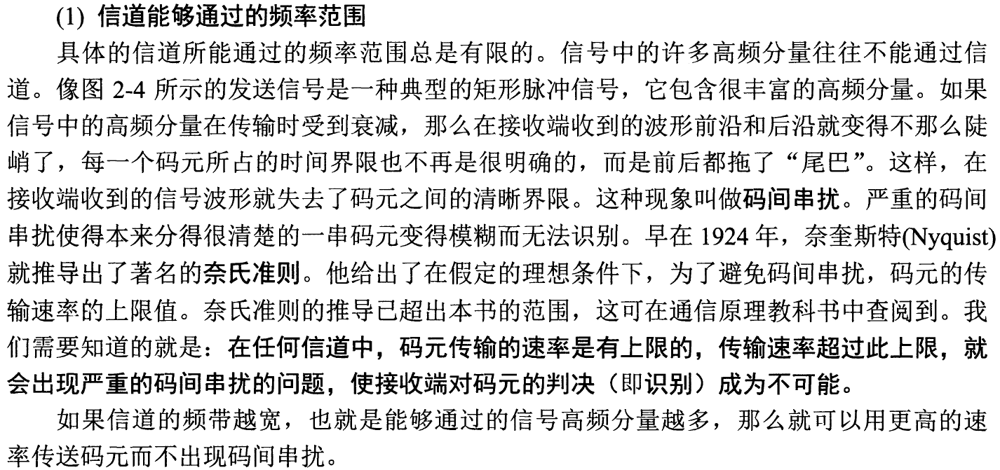

# 奈式准则与香农定理

## 奈式准则

谢希仁书中原文对奈式准则的描述，~~但是我并没有学过通信原理~~，因此这一章节内容基本是我的个人理解。

*实际上这一章节应该与通信原理关系更加密切，计算机网络这门课应该只需要理解+会套公式。。。

### 定理

- 理想低通（无噪声）信道的最高**码元传输速率** $=2W\ \text{Baud}$（2W，码元/秒）
- 理想带通（有噪声）信道的最高**码元传输速率** $=W\ \text{Baud}$（W，码元/秒）

上方 $W$ 指的是信道的带宽。码元可以看作是携带信息的一个单元，一个码元携带的信息量不一定是 $1bit$。

### 数据传输速率

- 数据传输速率=**波特率**（**码元传输速率**，或者叫调制速率）$\times$ 每个码元所携带的信息量。

> 注意一定要理清楚**奈式准则给出的是码元传输速率的上限**，数据传输速率还需要乘上每个码元的信息量。具体定义如下：
>
> - 波特率：单位时间内电子信号状态的变化数。
> - 传输率：单位时间内二进制位的传输个数。

### 例题

> 在**无噪声**情况下，若某通信链路的带宽为3kHz，采用4个相位，每个相位具有4种振幅的QAM调制技术，则该通信链路的最大数据传输速率是？

4个相位x4种振幅可以映射16种情况，因此最少需要4个比特位来表示，即一个码元的信息量是4bit。
$$
数据传输速率=2\times 3kHz\times 4bit = 24kb/s
$$
*赫兹这个单位可能比较令人迷惑（在这里赫兹应该直接代表波特率）。

## 香农定理

### 信噪比

**信噪比**是信号的平均功率和噪声的平均功率之比，常记作 $S/N$，并用分贝（dB）作为度量单位。

> 这句话很坑，它的意思是信噪比 $S/N$ 的单位需要转化为分贝，即
> $$
> 信噪比(dB)=10\log_{10}(S/N)
> $$
> 也就是说 $S/N$ 和 $10\log_{10}(S/N)$ 实际上都是信噪比，只是衡量的单位不一样。

### 香农公式

带宽受限且有高斯白噪声干扰的**信道的极限信息传输速率** $C$ 是
$$
C=W\log_2(1+S/N)\quad (bit/s)
$$
其中 $W$ 是信道的带宽；$S/N$ 是信噪比。

香农公式说明**信道的带宽或信噪比越大，信息的极限传输速率越高**。

> 一些需要注意的点：
>
> - 注意分贝的定义是 $\log_{10}$，香农公式中则是常规的 $\log_2$。
> - 香农公式中的信噪比**不是以分贝作为单位的**，如果题目中给你的信噪比是以分贝作为单位的，你需要先转化单位。

### 例题

> 若连接R2和R3链路的频率带宽为8kHz，信噪比为30dB，该链路实际数据传输速率约为理论最大数据传输速率的 $50\%$，则该链路的实际数据传输速率约为？

注意，题目中信噪比的单位是分贝，所以
$$
10\log_{10}(S/N)=30\Rightarrow S/N = 1000
$$
与此同时，注意题目中给出的特殊限制（该链路实际数据传输速率约为理论最大数据传输速率的 $50\%$），因此
$$
C=0.5\times W\log_2(1+S/N)=0.5\times 8kHz\times \log_2(1001)\approx40kb/s
$$

> 若信道在无噪声情况下的极限数据传输速率不小于信噪比为 $30dB$ 条件下的极限数据传输速率，则信号状态数至少是（）。

信道在无噪声情况下的极限数据传输速率在奈式准则中给出（2W*码元比特数），而信噪比为 $30dB$ 条件下的极限数据传输速率可以通过香农公式计算。此外，注意本题问的是信号状态数 $S$，我们知道状态数和码元比特数的关系如下
$$
码元比特数=\log_2S
$$
其实就是二进制的意义。于是就能列出本题的不等式
$$
\begin{aligned}
2W\log_2S &\ge W\log_2(1+S/N)\\
\log_2S &\ge0.5\times\log_2(1+1000)\approx5
\end{aligned}
$$
于是 $S\ge 32$。