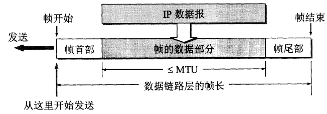

# 封装成帧

## 帧定界、帧同步与透明传输

**封装成帧**是指数据链路层给上层交付的协议数据单元（IP数据报）添加帧头和帧尾使之成为帧。

- 添加帧头和帧尾的意义就是**帧定界**，即确定帧的界限。
- 帧的收发双方应该做到**帧同步**，即接收方可以从接收到的比特流中确定每一帧的区域（帧头、帧尾）。
- **透明传输**是指不论什么比特组合的意义都应该是唯一的。以C语言为例，如果你想输出某些特殊符号，但是这些特殊符号是关键字，那你需要添加转义符号使得其定义唯一。

## 组帧方法

### 帧定界符和转义字符

一个简单的帧定界方法就是**设置两个特殊的符号**，**帧开始符（SOH, Start of Header）**和**帧结束符（EOT, End of Transmission）**，分别指明帧头和帧尾，如下。

这会造成一个问题，如果数据部分中也要传输和SOH或者EOT一样的字符，就不符合透明传输了。对于这种情况，可以设置**转义字符（ESC）**，每次读到一个转义字符后，接收方就会知道后一个字符被转义了，如下

这种方法也被称为是**字符填充法**。

### 字符计数

另一个简单的帧定界方法是在帧头设置一个计数字段来表明帧内字符数。比如第一个字节固定为帧长。

### 零比特填充

如图，设置一个特殊的比特流（01111110）作为帧的首尾字段。

为了保证透明传输的性质，我们需要在数据部分**连续出现5个1**后，在下一位插入一个额外的0（也就是说数据部分不可能出现连续的6个1，也就不可能出现帧的首尾字段了）。

### 违规编码

违规编码常见于物理层对比特流的编码。比如曼彻斯特编码，通常将比特0编码为“低->高电平”的跳变，比特1编码为“高->低电平”的跳变；于是我们可以将**不跳变**这一违规编码作为帧的定界符。

## 最大传送单元MTU

最大传输单元（Maximum Transmission Unit，MTU）。

以太网的MTU是1500B。