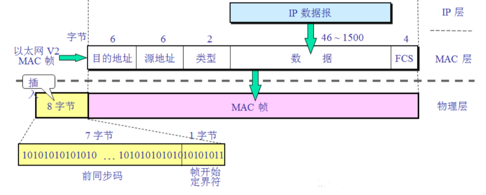

# 局域网

## 以太网

**以太网**（英语：Ethernet）是一种计算机局域网技术。IEEE组织的**IEEE 802.3**标准制定了以太网的技术标准，它规定了包括物理层的连线、电子信号和介质访问控制的内容。**以太网是目前应用最普遍的局域网技术**，取代了其他局域网标准如令牌环、FDDI和ARCNET。

### 以太网帧

如上图，以太网帧是IP数据报的一种封装手段，主要对IP数据报新增了以下的字段：

- **目的MAC地址**：字面意思。
- **源MAC地址**：字面意思。
- **类型**：标记上一层使用的协议，一般就是IPv4。
- **FCS**：帧校验序列（frame check sequence），即纠错码，以太网采用的是循环冗余校验（CRC）。

这里，因为以太网的最小帧长是64Byte（推导参考CSMA/CD），又因为以太网帧添加的字段长度为18B，所以IP数据报的长度区间为 $[46,1500]$。

物理层发送MAC帧还需要在字段最前部添加前同步码和帧开始定界符（8字符）。

### 