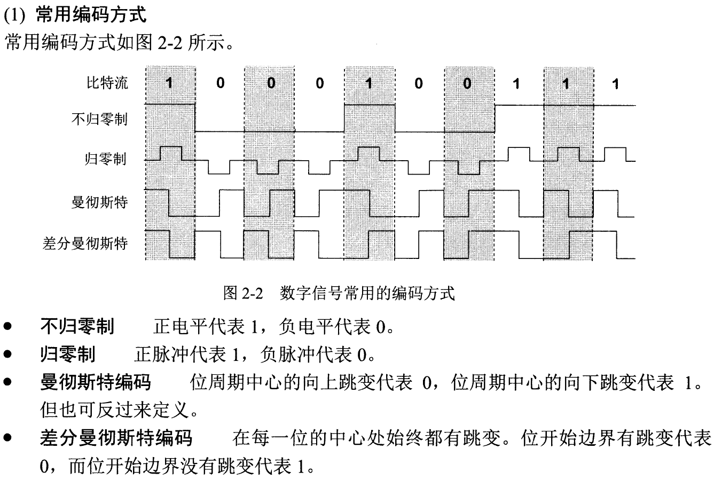

# 编码与调制

## 编码方式

上图是谢希仁教材中给出的4种常用编码方式，也就是一个物理层需要解决的核心问题：如何在物理媒介中传输信息（比特）。

其中曼彻斯特编码和差分曼彻斯特编码比较重要：

- **曼彻斯特编码**的特点是**每个时钟周期中心**都要进行一次跳变，通过向上跳还是向下跳判断这一个比特是0还是1（这个根据实际情况定义）。相较于归零编码、不归零编码，它的优势是**曼彻斯特编码是自同步的**。这是因为曼彻斯特编码每个时钟周期都要进行跳变，通信双方很容易保持时钟的同步。
- **差分曼彻斯特编码**和曼彻斯特编码基本是类似的，只不过差分曼彻斯特编码的特点是**每个时钟周期中心**都要进行一次跳变，这个跳变代表时钟信号；通过**两个周期之间是否发生跳变**来判断下一个比特是0还是1（这个根据实际情况定义）。