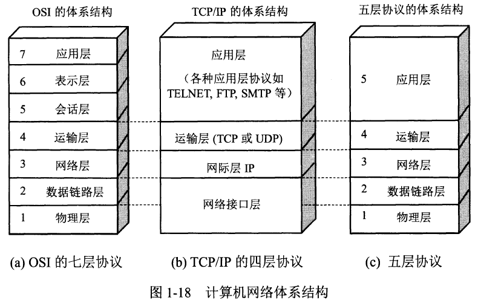

# 五层结构

## 五层结构模型的个人理解

1. **物理层**：物理层和数据链路层的概念很容易令人混淆（因为数据链路层似乎就是在物理设备上工作的），因此TCP/IP的四层协议实际上也把这两层归为一类。如果硬要指出这两层的区别，那就是：物理层负责的是沿着电线传输比特；数据链路层负责将这些比特正确地运输到对应的主机（实现一个网络中两个对象之间的通信）。
2. **数据链路层**：数据链路层和网络层的区别是比较明显的，数据链路层负责一个网络内的通信；网络层负责多个网络之间的通信。